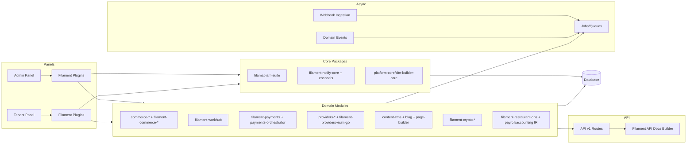

# SYSTEM_OVERVIEW

این سند نمای کلی معماری پلتفرم را برای پنل‌ها، ماژول‌ها، APIها و جریان‌های async ارائه می‌دهد.

## اصول کلیدی
- معماری package-first با Filament Plugin برای ثبت منابع/صفحات/ویجت‌ها.
- پنل‌های مجزا برای Admin و Tenant با کنترل دسترسی مبتنی بر IAM.
- APIهای نسخه‌بندی‌شده `/api/v1/*` با scope و rate limit.
- پردازش async برای وبهوک‌ها، سینک‌ها و اعلان‌ها.

## نمای کلان (Mermaid)

## توضیح لایه‌ها
- **Panels**: ثبت پلاگین‌ها و ارائه UI/Resources برای Admin و Tenant.
- **CorePackages**: IAM، Notification، و سرویس‌های پایه.
- **DomainModules**: دامنه‌های اصلی کسب‌وکار (Commerce/Workhub/Payments/Providers/...).
- **API**: لایه ورودی برای موبایل/سرویس‌ها با OpenAPI قابل انتشار.
- **Async**: صف‌ها و پردازش غیرهمزمان برای وبهوک و رویداد.
