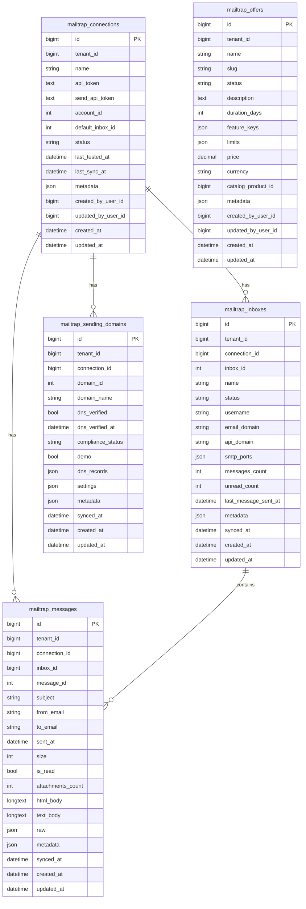

# ERD (Mailtrap)

```mermaid
erDiagram
    mailtrap_connections {
        bigint id PK
        bigint tenant_id
        string name
        text api_token
        text send_api_token
        int account_id
        int default_inbox_id
        string status
        datetime last_tested_at
        datetime last_sync_at
        json metadata
        bigint created_by_user_id
        bigint updated_by_user_id
        datetime created_at
        datetime updated_at
    }

    mailtrap_inboxes {
        bigint id PK
        bigint tenant_id
        bigint connection_id
        int inbox_id
        string name
        string status
        string username
        string email_domain
        string api_domain
        json smtp_ports
        int messages_count
        int unread_count
        datetime last_message_sent_at
        json metadata
        datetime synced_at
        datetime created_at
        datetime updated_at
    }

    mailtrap_messages {
        bigint id PK
        bigint tenant_id
        bigint connection_id
        bigint inbox_id
        int message_id
        string subject
        string from_email
        string to_email
        datetime sent_at
        int size
        bool is_read
        int attachments_count
        longtext html_body
        longtext text_body
        json raw
        json metadata
        datetime synced_at
        datetime created_at
        datetime updated_at
    }

    mailtrap_sending_domains {
        bigint id PK
        bigint tenant_id
        bigint connection_id
        int domain_id
        string domain_name
        bool dns_verified
        datetime dns_verified_at
        string compliance_status
        bool demo
        json dns_records
        json settings
        json metadata
        datetime synced_at
        datetime created_at
        datetime updated_at
    }

    mailtrap_offers {
        bigint id PK
        bigint tenant_id
        string name
        string slug
        string status
        text description
        int duration_days
        json feature_keys
        json limits
        decimal price
        string currency
        bigint catalog_product_id
        json metadata
        bigint created_by_user_id
        bigint updated_by_user_id
        datetime created_at
        datetime updated_at
    }

    mailtrap_connections ||--o{ mailtrap_inboxes : has
    mailtrap_connections ||--o{ mailtrap_messages : has
    mailtrap_inboxes ||--o{ mailtrap_messages : contains
    mailtrap_connections ||--o{ mailtrap_sending_domains : has
```

