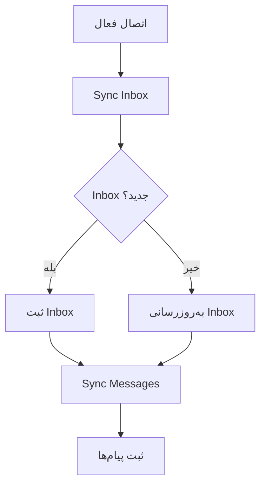
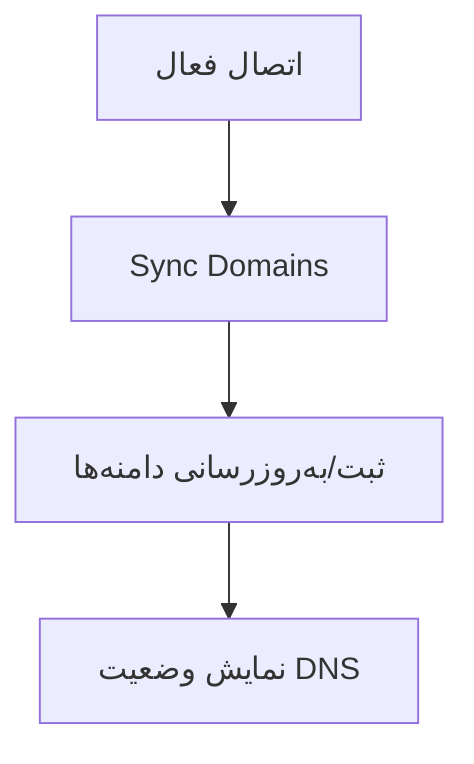
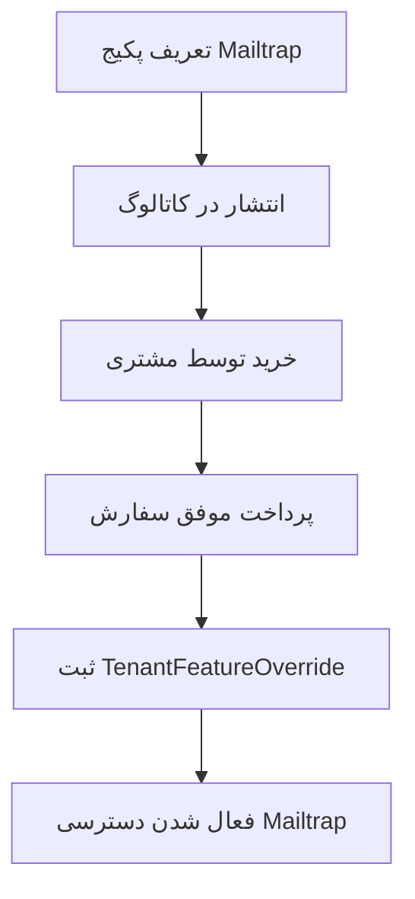

# گردش‌کارها (Mailtrap)

## Sync Inbox و پیام‌ها

```mermaid
flowchart TD
    A[اتصال فعال] --> B[Sync Inbox]
    B --> C{Inbox جدید؟}
    C -->|بله| D[ثبت Inbox]
    C -->|خیر| E[به‌روزرسانی Inbox]
    D --> F[Sync Messages]
    E --> F[Sync Messages]
    F --> G[ثبت پیام‌ها]
```

## Sync دامنه‌های ارسال

```mermaid
flowchart TD
    A[اتصال فعال] --> B[Sync Domains]
    B --> C[ثبت/به‌روزرسانی دامنه‌ها]
    C --> D[نمایش وضعیت DNS]
```

## فروش پکیج و اعمال دسترسی

```mermaid
flowchart TD
    A[تعریف پکیج Mailtrap] --> B[انتشار در کاتالوگ]
    B --> C[خرید توسط مشتری]
    C --> D[پرداخت موفق سفارش]
    D --> E[ثبت TenantFeatureOverride]
    E --> F[فعال شدن دسترسی Mailtrap]
```

