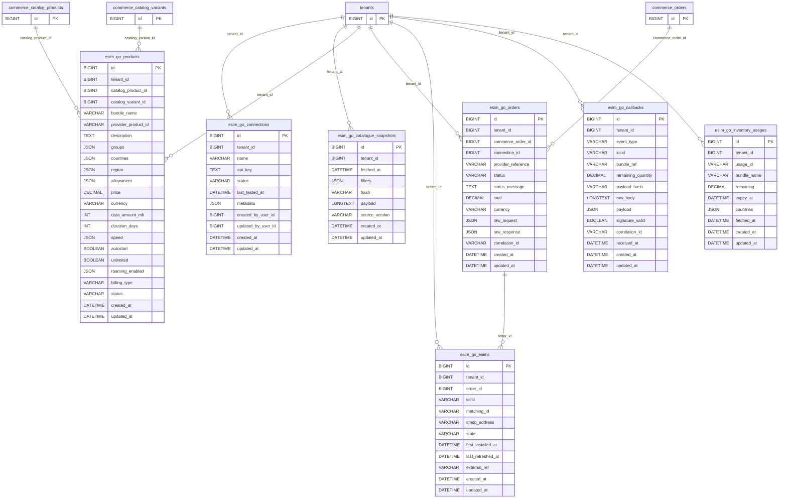

# ERD — eSIM Go

```mermaid
erDiagram
  esim_go_connections {
    BIGINT id PK
    BIGINT tenant_id
    VARCHAR name
    TEXT api_key
    VARCHAR status
    DATETIME last_tested_at
    JSON metadata
    BIGINT created_by_user_id
    BIGINT updated_by_user_id
    DATETIME created_at
    DATETIME updated_at
  }

  esim_go_catalogue_snapshots {
    BIGINT id PK
    BIGINT tenant_id
    DATETIME fetched_at
    JSON filters
    VARCHAR hash
    LONGTEXT payload
    VARCHAR source_version
    DATETIME created_at
    DATETIME updated_at
  }

  esim_go_products {
    BIGINT id PK
    BIGINT tenant_id
    BIGINT catalog_product_id
    BIGINT catalog_variant_id
    VARCHAR bundle_name
    VARCHAR provider_product_id
    TEXT description
    JSON groups
    JSON countries
    JSON region
    JSON allowances
    DECIMAL price
    VARCHAR currency
    INT data_amount_mb
    INT duration_days
    JSON speed
    BOOLEAN autostart
    BOOLEAN unlimited
    JSON roaming_enabled
    VARCHAR billing_type
    VARCHAR status
    DATETIME created_at
    DATETIME updated_at
  }

  esim_go_orders {
    BIGINT id PK
    BIGINT tenant_id
    BIGINT commerce_order_id
    BIGINT connection_id
    VARCHAR provider_reference
    VARCHAR status
    TEXT status_message
    DECIMAL total
    VARCHAR currency
    JSON raw_request
    JSON raw_response
    VARCHAR correlation_id
    DATETIME created_at
    DATETIME updated_at
  }

  esim_go_esims {
    BIGINT id PK
    BIGINT tenant_id
    BIGINT order_id
    VARCHAR iccid
    VARCHAR matching_id
    VARCHAR smdp_address
    VARCHAR state
    DATETIME first_installed_at
    DATETIME last_refreshed_at
    VARCHAR external_ref
    DATETIME created_at
    DATETIME updated_at
  }

  esim_go_callbacks {
    BIGINT id PK
    BIGINT tenant_id
    VARCHAR event_type
    VARCHAR iccid
    VARCHAR bundle_ref
    DECIMAL remaining_quantity
    VARCHAR payload_hash
    LONGTEXT raw_body
    JSON payload
    BOOLEAN signature_valid
    VARCHAR correlation_id
    DATETIME received_at
    DATETIME created_at
    DATETIME updated_at
  }

  esim_go_inventory_usages {
    BIGINT id PK
    BIGINT tenant_id
    VARCHAR usage_id
    VARCHAR bundle_name
    DECIMAL remaining
    DATETIME expiry_at
    JSON countries
    DATETIME fetched_at
    DATETIME created_at
    DATETIME updated_at
  }

  tenants {
    BIGINT id PK
  }

  commerce_orders {
    BIGINT id PK
  }

  commerce_catalog_products {
    BIGINT id PK
  }

  commerce_catalog_variants {
    BIGINT id PK
  }

  tenants ||--o{ esim_go_connections : tenant_id
  tenants ||--o{ esim_go_catalogue_snapshots : tenant_id
  tenants ||--o{ esim_go_products : tenant_id
  tenants ||--o{ esim_go_orders : tenant_id
  tenants ||--o{ esim_go_esims : tenant_id
  tenants ||--o{ esim_go_callbacks : tenant_id
  tenants ||--o{ esim_go_inventory_usages : tenant_id
  commerce_orders ||--o{ esim_go_orders : commerce_order_id
  commerce_catalog_products ||--o{ esim_go_products : catalog_product_id
  commerce_catalog_variants ||--o{ esim_go_products : catalog_variant_id
  esim_go_orders ||--o{ esim_go_esims : order_id
```
