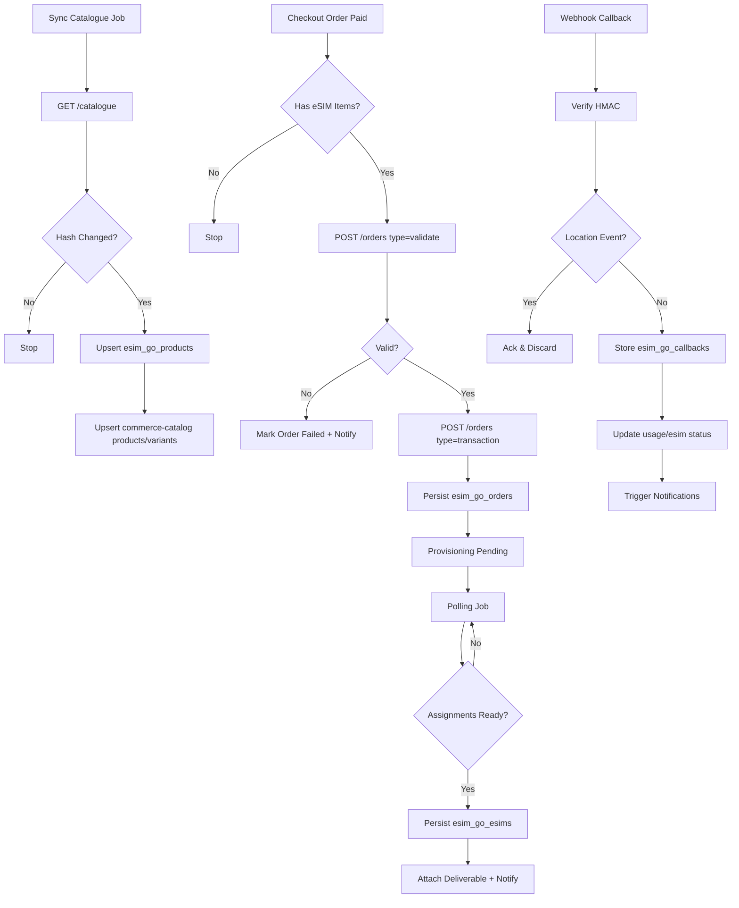

# Workflowهای eSIM Go

```mermaid
flowchart TD
  A[Sync Catalogue Job] --> B[GET /catalogue]
  B --> C{Hash Changed?}
  C -- No --> D[Stop]
  C -- Yes --> E[Upsert esim_go_products]
  E --> F[Upsert commerce-catalog products/variants]

  G[Checkout Order Paid] --> H{Has eSIM Items?}
  H -- No --> I[Stop]
  H -- Yes --> J[POST /orders type=validate]
  J --> K{Valid?}
  K -- No --> L[Mark Order Failed + Notify]
  K -- Yes --> M[POST /orders type=transaction]
  M --> N[Persist esim_go_orders]
  N --> O[Provisioning Pending]
  O --> P[Polling Job]
  P --> Q{Assignments Ready?}
  Q -- No --> P
  Q -- Yes --> R[Persist esim_go_esims]
  R --> S[Attach Deliverable + Notify]

  T[Webhook Callback] --> U[Verify HMAC]
  U --> V{Location Event?}
  V -- Yes --> W[Ack & Discard]
  V -- No --> X[Store esim_go_callbacks]
  X --> Y[Update usage/esim status]
  Y --> Z[Trigger Notifications]
```

